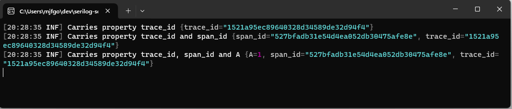

# Serilog.Enrichers.ScopedLogContext

[](https://github.com/MonticolaExplorator/serilog-scopedlogcontext/actions/workflows/build-and-test.yml) [](https://github.com/MonticolaExplorator/serilog-scopedlogcontext/actions/workflows/release.yml)

A [Serilog](https://serilog.net/) enricher to add properties to your log events.

## Getting started

Add the Serilog namespace to your startup or program C# file:

```csharp
using Serilog;
using Serilog.Context;
```

Include the scoped log context enricher in your logger configuration:

```csharp
Log.Logger = new LoggerConfiguration()
    .Enrich.FromScopedLogContext()
    //rest of the configuration...
```

The `FromScopedLogContext()` enricher adds the properties present on the `Serilog.Context.ScopedLogContext`, to all log events produced in the current async flow. Then create or inject an instance of the scoped log context:

```csharp
var scopedLogContext = new ScopedLogContext()
```

Finally, the properties can be added and removed from the Http request log context using `ScopedLogContext.PushProperty`:

```csharp
scopedLogContext.PushProperty("trace_id", Guid.NewGuid().ToString("N"));
scopedLogContext.PushProperty("span_id", Guid.NewGuid().ToString("N"));
```

After the above code is executed, any log event written to any Serilog sink on the current async flow will contain the properties `trace_id` and `span_id` automatically. 



In the [sample](sample/) folder, there's an example of a .NET app that uses Serilog for logging to the `Console` using this enricher, as described above.

### Removing properties

The `Serilog.Context.ScopedLogContext` is automatically cleared when the instance is disposed. 

```csharp
using(var scopedLogContext = new ScopedLogContext())
{
    scopedLogContext.PushProperty("A", 1);

    Log.Information("Carries property A = 1");

    scopedLogContext.PushProperty("A", 2);
    scopedLogContext.PushProperty("B", 1);
    
    Log.Information("Carries A = 2 and B = 1");
}

Log.Information("Carries no properties");
```

However, properties can also be removed manually from the context by disposing the object returned by the `ScopedLogContext.PushProperty` method:

```csharp
using(var scopedLogContext = new ScopedLogContext())
{
    scopedLogContext.PushProperty("A", 1);

    Log.Information("Carries property A = 1");

    using (scopedLogContext.PushProperty("A", 2))
    using (scopedLogContext.PushProperty("B", 1))
    {
        Log.Information("Carries A = 2 and B = 1");
    }

    Log.Information("Carries property A = 1, again");
}
Log.Information("Carries no properties");
```

Pushing a property onto the `Serilog.Context.HttpRequestLogContext` will override any existing properties with the same name, until the object returned from `PushProperty()` is disposed, as the property `A` in the example demonstrates.

**Important:** popping a property also pops all the properties pushed to the http context on top of it, as the next example demonstrates.

```csharp
Log.Information("Carries no properties");

using (HttpRequestLogContext.PushProperty("A", 1))
{
    HttpRequestLogContext.PushProperty("B", 1);
    Log.Information("Carries A = 1 and B = 1");
}

Log.Information("Carries no properties, again");
```

